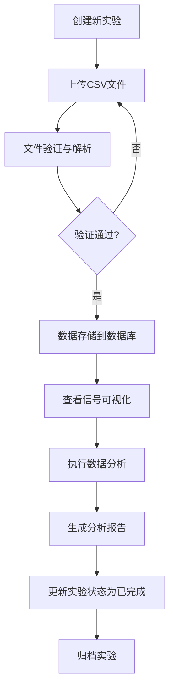

# 磁检测数据管理系统 - 产品需求文档 (PRD)

**版本**: 1.0  
**日期**: 2025年1月  
**状态**: 初始版本

---

## 1. 项目概述

### 1.1 项目背景

磁检测技术（Magnetic Testing, MT）是一种重要的无损检测（Non-Destructive Testing, NDT）方法，广泛应用于航空航天、石油化工、钢铁制造、压力容器等工业领域。通过检测材料表面和近表面的磁场变化，可以有效识别裂纹、夹杂、疏松等缺陷。

随着检测设备的数字化发展，磁检测系统产生大量的数字信号数据。这些数据需要有效的管理、可视化和分析工具来支持：
- 质量控制决策
- 缺陷识别与分类
- 检测记录追溯
- 数据趋势分析
- 符合行业标准要求

本系统旨在为磁检测实验室提供一个现代化、专业化的数据管理平台。

### 1.2 产品定位

**目标用户**：
- 无损检测工程师
- 质量控制人员
- 实验室管理员
- 数据分析师

**核心价值**：
- 集中化的实验数据管理
- 直观的信号可视化展示
- 智能的数据分析能力
- 符合国际标准的工作流程

### 1.3 国际标准参考

本系统遵循以下国际标准和行业规范：

#### 磁检测相关标准
- **ISO 9934-1**: 无损检测 - 磁粉检测 第1部分：总则
- **ISO 9934-2**: 无损检测 - 磁粉检测 第2部分：检测介质
- **ISO 9934-3**: 无损检测 - 磁粉检测 第3部分：设备
- **EN ISO 9712**: 无损检测 - 无损检测人员资格鉴定与认证
- **ASTM E709**: 磁粉检测标准指南
- **ASTM E1444**: 磁粉检测标准实践
- **GB/T 15822**: 磁粉检测方法和磁粉技术检测的验收标准（中国标准）

#### 人员资格标准
- **ASNT SNT-TC-1A**: 美国无损检测学会人员资格鉴定与认证推荐实施方法
- **ISO 9712**: 无损检测人员资格鉴定与认证

#### 质量管理标准
- **ISO 9001**: 质量管理体系要求
- **ISO/IEC 17025**: 检测和校准实验室能力的通用要求

---

## 2. 数据结构规范

### 2.1 CSV数据格式

磁检测系统输出的CSV文件遵循以下规范：

**文件格式**：
- 编码：UTF-8
- 分隔符：逗号（,）
- 第一行：表头（列名）

**数据结构**：
```
FrameID, BeamID, Pos1, Pos2, Pos3, ..., Pos896
```

**字段说明**：

| 字段名 | 数据类型 | 说明 | 取值范围 |
|--------|---------|------|----------|
| FrameID | 整数 | 数据帧编号，表示采集的时间序列 | 1-N |
| BeamID | 整数 | 传感器通道编号 | 1-20 |
| Pos1-Pos896 | 整数 | 896个空间位置的磁场强度值 | 0-255 |

**数据采集参数**：
- 采样率：可配置，典型值100-1000 Hz
- 空间分辨率：每个Pos代表约0.1-1mm空间间隔
- 信号幅度：8位量化，0-255对应磁场强度

**数据质量要求**：
- 数值完整性：不允许缺失值（NULL）
- 范围合法性：所有Pos值必须在0-255之间
- 顺序一致性：FrameID必须连续或递增

### 2.2 示例数据分析

基于提供的4个CSV样本文件：
- `1-焊缝.csv`: 焊缝检测数据，包含11142帧
- `2-斜坡.csv`: 斜坡结构检测数据
- `2-双层-3.csv`: 双层结构检测数据
- `3-单层-1.csv`: 单层结构检测数据

**观察到的数据特征**：
- 信号幅度变化：大部分位置在0-50范围内
- 异常峰值：某些位置出现255（饱和值），指示可能的缺陷
- 空间连续性：相邻Pos值通常具有连续性
- 帧间相关性：连续帧之间存在时间相关性

---

## 3. 功能需求

### 3.1 功能架构

```
磁检测数据管理系统
├── 数据大屏（Dashboard）
├── 实验管理（Experiments）
├── 文件管理（Files）
├── 信号可视化（Signal Visualization）
├── 数据分析（Analysis）
└── 系统设置（Settings）
```

### 3.2 详细功能说明

#### 3.2.1 数据大屏

**目标**：提供系统全局概览和关键指标监控

**功能清单**：

1. **统计卡片**
   - 总实验数量
   - 总文件数量
   - 今日上传文件数
   - 检测到的异常数量
   - 存储空间使用情况

2. **实验状态分布**
   - 饼图展示：进行中、已完成、已归档实验占比
   - 柱状图展示：各实验类型数量分布

3. **数据上传趋势**
   - 折线图：最近30天上传文件数趋势
   - 区域图：数据量增长趋势

4. **最近实验列表**
   - 显示最近10条实验记录
   - 快速查看状态、日期、操作员
   - 快速操作入口（查看详情、查看数据）

5. **磁信号强度概览**
   - 热力图缩略图：显示典型信号模式
   - 异常热点标记

6. **数据质量指标**
   - 仪表盘展示：数据完整性、信号质量评分
   - 趋势指示器

**交互要求**：
- 实时数据刷新（30秒间隔）
- 点击卡片跳转到详细页面
- 支持日期范围筛选

#### 3.2.2 实验管理

**目标**：管理磁检测实验的完整生命周期

**功能清单**：

1. **实验列表**
   - 表格展示所有实验
   - 支持分页（10/20/50条/页）
   - 支持排序（按日期、名称、状态）
   - 支持筛选（实验类型、状态、日期范围、操作员）
   - 支持搜索（实验名称、描述）
   - 批量操作（删除、归档、导出）

2. **创建新实验**
   - 模态框表单，包含以下字段：
     * **基本信息**：
       - 实验名称（必填，2-100字符）
       - 实验类型（下拉选择）
       - 实验日期（日期选择器，默认今天）
       - 操作员（文本输入）
     * **技术参数**：
       - 执行标准（下拉选择国际标准）
       - 被检材料（文本输入，如：Q235钢、16Mn钢）
       - 材料厚度（数值输入，单位mm）
       - 磁化方法（下拉选择：直接通电法、中心导体法、磁轭法、线圈法）
       - 检测设备（文本输入，设备型号）
     * **其他**：
       - 实验描述（文本域，0-500字符）
   - 表单验证（客户端+服务器端）
   - 提交后跳转到实验详情页

3. **实验类型模板**

   根据ISO 9934标准，提供以下预设实验类型：

   | 实验类型 | 英文名称 | 应用场景 | 推荐标准 |
   |---------|---------|---------|---------|
   | 焊缝检测 | Weld Inspection | 焊接接头表面和近表面裂纹检测 | ISO 9934-1, AWS D1.1 |
   | 表面缺陷检测 | Surface Defect Detection | 机加工表面、铸锻件表面缺陷 | ASTM E709 |
   | 双层结构检测 | Multilayer Structure | 复合材料、堆焊层检测 | ISO 9934-2 |
   | 应力集中区检测 | Stress Concentration | 高应力区域、疲劳裂纹检测 | ASTM E1444 |
   | 腐蚀检测 | Corrosion Detection | 点蚀、应力腐蚀裂纹检测 | ISO 9934-3 |

4. **实验详情页**
   - 展示所有实验信息（只读模式）
   - 编辑按钮（切换到编辑模式）
   - 关联文件列表（可上传新文件）
   - 分析结果列表
   - 操作历史记录（时间线展示）
   - 导出实验报告按钮

5. **实验编辑**
   - 复用创建表单
   - 预填充现有数据
   - 保存更新

6. **实验删除**
   - 二次确认对话框
   - 提示关联数据（文件、分析结果）
   - 选项：级联删除 / 仅删除实验记录

7. **实验状态管理**
   - 状态流转：进行中 → 已完成 → 已归档
   - 状态变更需要确认
   - 记录状态变更历史

8. **导出实验报告**
   - 生成PDF格式报告
   - 包含：
     * 实验基本信息
     * 技术参数
     * 关联文件清单
     * 代表性信号图表
     * 分析结果摘要
     * 操作员签名位
     * 审核签名位
   - 符合ISO 9001文档要求

**数据验证规则**：
- 实验名称不能重复
- 日期不能晚于当前日期
- 数值型字段范围检查
- 材料厚度 > 0

#### 3.2.3 文件管理

**目标**：管理CSV数据文件的上传、存储和基础操作

**功能清单**：

1. **文件上传**
   - 拖拽上传区域（支持拖放文件）
   - 点击上传按钮（打开文件选择器）
   - 多文件上传（最多10个）
   - 文件类型限制：仅CSV格式
   - 文件大小限制：单个文件最大500MB
   - 上传进度条（单个文件进度）
   - 关联实验选择（下拉菜单，可搜索）

2. **文件验证**
   
   上传前进行以下验证：
   - **格式验证**：
     * 文件扩展名为.csv
     * UTF-8编码检测
     * 正确的CSV格式（逗号分隔）
   - **结构验证**：
     * 第一行包含正确的表头
     * 列数为898（FrameID + BeamID + 896个Pos）
     * 列名称匹配：FrameID, BeamID, Pos1-Pos896
   - **数据验证**：
     * FrameID和BeamID为整数
     * 所有Pos值在0-255范围内
     * 不存在空值或非法字符
   
   验证失败时：
   - 显示详细错误信息
   - 指出错误的行号和列
   - 提供修复建议
   - 拒绝上传

3. **文件列表**
   - 两种视图模式：
     * **列表视图**：表格形式，显示详细信息
     * **网格视图**：卡片形式，适合浏览
   - 显示信息：
     * 文件名
     * 关联实验
     * 上传日期
     * 文件大小
     * 帧数统计
     * 状态（已解析/解析中/解析失败）
   - 排序：按上传日期、文件大小、文件名
   - 筛选：按实验、日期范围、状态
   - 搜索：文件名搜索

4. **文件预览**
   - 模态框展示
   - 显示前100行数据
   - 表格形式展示
   - 支持水平和垂直滚动
   - 显示基础统计：
     * 总行数
     * FrameID范围
     * BeamID范围
     * 信号值范围（min, max, avg）

5. **文件下载**
   - 直接下载原始CSV文件
   - 生成下载链接
   - 下载计数统计

6. **文件删除**
   - 单个删除：二次确认对话框
   - 批量删除：显示删除数量，二次确认
   - 提示关联数据影响
   - 删除后不可恢复警告

7. **文件元数据编辑**
   - 修改文件名
   - 更改关联实验
   - 添加备注
   - 标记重要文件

8. **批量操作**
   - 多选文件（复选框）
   - 批量下载（打包为ZIP）
   - 批量删除
   - 批量更改实验关联

**性能要求**：
- 单个文件上传时间 < 30秒（100MB文件）
- 文件列表加载 < 2秒（100个文件）
- 预览响应 < 1秒

#### 3.2.4 磁信号可视化

**目标**：以直观、专业的方式展示磁检测信号数据

**功能清单**：

1. **2D热力图（主视图）**
   
   - **坐标轴**：
     * X轴：Position (1-896)
     * Y轴：Frame ID (1-N)
     * 颜色：信号强度（0-255）
   
   - **配色方案**：
     * 默认：Viridis（蓝-绿-黄）
     * 备选：Jet（蓝-青-黄-红）、Gray（灰度）、Hot（黑-红-黄-白）
     * 工业化：深蓝-科技蓝-橙色警告-红色危险
   
   - **交互功能**：
     * 鼠标悬停：显示(Frame, Pos, Value)
     * 区域缩放：框选放大
     * 拖动平移
     * 双击重置视图
     * 滚轮缩放
   
   - **辅助标记**：
     * 异常区域高亮（值 > 阈值）
     * 自定义标注（添加文字标记）
     * 参考线（水平线、垂直线）

2. **3D曲面图（可选视图）**
   
   - **坐标轴**：
     * X轴：Position
     * Y轴：Frame ID
     * Z轴：信号强度
   
   - **交互功能**：
     * 旋转视角（鼠标拖拽）
     * 缩放
     * 视角预设（俯视、侧视、等轴侧）
   
   - **渲染选项**：
     * 曲面+网格
     * 仅曲面（着色）
     * 仅网格（线框）

3. **时间序列折线图**
   
   - **单Beam分析**：
     * 选择特定BeamID（下拉选择）
     * X轴：Frame ID
     * Y轴：选定Position的信号值
     * 多Position对比（最多5条线）
   
   - **多Beam对比**：
     * 选择多个BeamID（复选框）
     * 同一Position不同Beam的信号对比
     * 图例显示
   
   - **交互功能**：
     * 区域缩放
     * 数据点标注
     * 峰值自动标记

4. **信号强度分布直方图**
   
   - **全局分布**：
     * X轴：信号强度区间（0-255分为20个bin）
     * Y轴：频数或频率
   
   - **分区域分布**：
     * 选定Frame范围
     * 选定Position范围
     * 动态更新直方图
   
   - **统计信息**：
     * 均值、标准差
     * 中位数、四分位数
     * 偏度、峰度

5. **异常区域标注**
   
   - **自动检测**：
     * 基于阈值（用户可调）
     * 自动框选异常区域
     * 异常程度分级（低、中、高）
   
   - **手动标注**：
     * 矩形选框
     * 多边形选框
     * 添加文字说明
     * 保存标注结果

6. **信号波形对比**
   
   - **同步对比模式**：
     * 多个文件同一Position的信号对比
     * 时间对齐
     * 差异高亮
   
   - **叠加显示**：
     * 半透明叠加
     * 颜色区分
     * 图例说明

7. **交互式缩放与平移**
   
   - **缩放模式**：
     * 框选缩放
     * 滚轮缩放
     * 按钮缩放（放大/缩小/复位）
   
   - **平移模式**：
     * 鼠标拖拽
     * 方向键控制
     * 缩略图导航

8. **数据导出**
   
   - **图片导出**：
     * PNG格式（高分辨率，300dpi）
     * SVG格式（矢量图）
     * JPEG格式（压缩）
     * 尺寸选择（1920x1080, 3840x2160, 自定义）
   
   - **数据导出**：
     * CSV格式（选定区域数据）
     * Excel格式（含多个sheet）
     * JSON格式（含元数据）

**视图控制面板**：
- 视图切换按钮（2D热力图/3D曲面/折线图/直方图）
- BeamID选择器
- Position范围滑块
- Frame范围滑块
- 配色方案选择
- 阈值调节滑块
- 显示/隐藏标注
- 全屏模式切换

**性能要求**：
- 热力图渲染 < 3秒（10000帧×896位置）
- 交互响应 < 100ms
- 平滑缩放（60fps）

#### 3.2.5 数据分析

**目标**：提供智能的信号分析工具，辅助缺陷识别和数据解读

**功能清单**：

1. **峰值检测**
   
   - **算法**：
     * 一阶导数法
     * 二阶导数法
     * 小波变换法
   
   - **参数配置**：
     * 峰值阈值（最小高度）
     * 峰值宽度范围
     * 相邻峰间隔
     * 灵敏度调节
   
   - **结果展示**：
     * 峰值位置标记
     * 峰值统计表（位置、高度、宽度）
     * 峰值分布图

2. **基线校正**
   
   - **方法**：
     * 多项式拟合（1-5阶）
     * 移动平均
     * 中值滤波
   
   - **参数**：
     * 拟合阶数
     * 窗口大小
   
   - **预览**：
     * 原始信号 vs 校正后信号
     * 差值信号
     * 实时调节

3. **噪声过滤**
   
   - **滤波器类型**：
     * 低通滤波（去除高频噪声）
     * 高通滤波（去除低频漂移）
     * 带通滤波
     * 中值滤波（去除脉冲噪声）
   
   - **参数**：
     * 截止频率
     * 滤波器阶数
     * 窗口大小
   
   - **效果对比**：
     * 前后对比图
     * SNR（信噪比）计算

4. **特征提取**
   
   提取以下统计特征：
   
   - **时域特征**：
     * 最大值（Max）
     * 最小值（Min）
     * 平均值（Mean）
     * 标准差（Std）
     * 峰峰值（Peak-to-Peak）
     * 方均根（RMS）
     * 波形因子
     * 峰值因子
     * 脉冲因子
   
   - **频域特征**（通过FFT）：
     * 主频率
     * 频谱能量
     * 功率谱密度
   
   - **形状特征**：
     * 偏度（Skewness）
     * 峰度（Kurtosis）
     * 熵
   
   - **结果输出**：
     * 特征表格
     * 特征对比雷达图
     * 特征相关性矩阵

5. **缺陷识别算法**
   
   - **基于阈值的方法**：
     * 单阈值分割
     * 双阈值分割
     * 自适应阈值
   
   - **基于形态学的方法**：
     * 膨胀/腐蚀
     * 开运算/闭运算
     * 连通域分析
   
   - **机器学习方法**（未来扩展）：
     * 支持向量机（SVM）
     * 随机森林
     * 深度学习
   
   - **缺陷分类**：
     * 裂纹型缺陷
     * 夹杂型缺陷
     * 疏松型缺陷
     * 未知缺陷
   
   - **置信度评分**：
     * 0-100分
     * 分级：低置信度、中置信度、高置信度

6. **阈值设置**
   
   - **全局阈值**：
     * 单一阈值应用于所有数据
     * 滑块调节
     * 百分位数选择（P90, P95, P99）
   
   - **自适应阈值**：
     * 局部阈值计算
     * 窗口大小设置
   
   - **预设方案**：
     * 保守型（高阈值，少误报）
     * 均衡型（中阈值）
     * 激进型（低阈值，少漏报）
   
   - **实时预览**：
     * 不同阈值效果对比
     * 检出率统计

7. **分析结果可视化**
   
   - **综合报告视图**：
     * 原始信号图
     * 处理后信号图
     * 特征分布图
     * 缺陷标记图
   
   - **对比分析**：
     * 多次分析结果对比
     * 不同参数效果对比
   
   - **导出选项**：
     * PNG图片
     * PDF报告

8. **生成分析报告**
   
   - **报告内容**：
     * 分析摘要
     * 输入参数
     * 统计特征表
     * 可视化图表
     * 缺陷清单
     * 结论与建议
   
   - **报告格式**：
     * PDF（适合打印）
     * HTML（适合在线查看）
     * Word（可编辑）
   
   - **报告模板**：
     * 标准模板
     * 简化模板
     * 详细模板
     * 自定义模板

**分析流程**：
1. 选择数据文件
2. 选择分析类型
3. 配置参数
4. 预览效果
5. 执行分析
6. 查看结果
7. 生成报告
8. 保存分析记录

**保存分析结果**：
- 自动保存到数据库（analysis_results表）
- 关联到源文件
- 记录分析参数
- 可追溯、可复现

#### 3.2.6 系统设置

**目标**：提供系统级配置和管理功能

**功能清单**：

1. **数据导入配置**
   - CSV分隔符设置（逗号、分号、制表符）
   - 默认编码设置（UTF-8、GBK）
   - 数据验证严格程度（严格/宽松）
   - 自动解析开关
   - 最大文件大小限制

2. **显示偏好设置**
   - 语言选择（当前仅中文，预留国际化）
   - 时区设置
   - 日期格式（YYYY-MM-DD / DD/MM/YYYY）
   - 数字格式（千分位、小数位数）
   - 主题选择（深色/浅色/自动）
   - 配色方案（工业蓝/科技绿/经典灰）

3. **分析参数配置**
   - 默认阈值
   - 默认滤波参数
   - 默认峰值检测参数
   - 自动分析开关

4. **数据保留策略**
   - 数据保留期限（30天/90天/1年/永久）
   - 自动归档规则
   - 自动清理规则
   - 备份频率设置

5. **系统信息**
   - 版本号
   - 数据库连接状态
   - 存储空间使用情况
   - API调用统计
   - 系统日志查看

---

## 4. 用户流程

### 4.1 典型工作流程



### 4.2 用户角色与权限

本系统采用公开访问模式（无登录要求），但预留权限管理接口供未来扩展。

**未来扩展的角色**：
- **管理员**：全部权限
- **工程师**：创建实验、上传文件、分析数据
- **操作员**：上传文件、查看数据
- **访客**：仅查看

---

## 5. 技术架构

### 5.1 技术栈

**前端**：
- **框架**：Next.js 14 (App Router)
- **语言**：TypeScript
- **样式**：Tailwind CSS + shadcn/ui
- **图表**：Recharts + D3.js
- **状态管理**：Zustand
- **数据处理**：Papa Parse (CSV)
- **日期处理**：date-fns

**后端**：
- **数据库**：Supabase (PostgreSQL)
- **存储**：Supabase Storage
- **实时通信**：Supabase Realtime

**部署**：
- **平台**：Vercel
- **CI/CD**：GitHub Actions

### 5.2 数据库设计

详见第2节"数据结构规范"和计划文档中的数据库表结构。

### 5.3 系统架构图

```
┌─────────────────────────────────────────┐
│         Next.js 14 Frontend             │
│  ┌─────────┬──────────┬───────────┐    │
│  │Dashboard│Experiments│  Files    │    │
│  ├─────────┼──────────┼───────────┤    │
│  │ Signals │ Analysis │ Settings  │    │
│  └─────────┴──────────┴───────────┘    │
└──────────────┬──────────────────────────┘
               │
               │ REST API / Realtime
               │
┌──────────────▼──────────────────────────┐
│           Supabase Backend              │
│  ┌──────────────┬──────────────────┐   │
│  │  PostgreSQL  │  Storage Bucket  │   │
│  │  (Database)  │  (File Storage)  │   │
│  └──────────────┴──────────────────┘   │
└─────────────────────────────────────────┘
```

---

## 6. 非功能需求

### 6.1 性能要求

- **页面加载时间**：首次加载 < 3秒，后续导航 < 1秒
- **文件上传速度**：支持100MB文件在30秒内上传完成
- **数据查询响应**：单次查询 < 2秒
- **图表渲染性能**：万级数据点渲染 < 3秒
- **并发用户**：支持50个并发用户

### 6.2 可用性要求

- **系统可用性**：99.5%（基于Vercel和Supabase SLA）
- **数据备份**：每日自动备份
- **容灾恢复**：RPO < 24小时，RTO < 2小时

### 6.3 安全性要求

- **数据传输**：全程HTTPS加密
- **SQL注入防护**：使用Supabase参数化查询
- **XSS防护**：Next.js内置防护机制
- **文件上传安全**：
  - 文件类型白名单
  - 文件大小限制
  - 病毒扫描（未来扩展）

### 6.4 兼容性要求

- **浏览器支持**：
  - Chrome 90+
  - Firefox 88+
  - Safari 14+
  - Edge 90+
- **屏幕分辨率**：
  - 最小：1366×768
  - 推荐：1920×1080或更高
- **移动端**：响应式设计，支持平板访问

### 6.5 可维护性要求

- **代码规范**：遵循Airbnb JavaScript风格指南
- **文档完整性**：
  - 代码注释覆盖率 > 80%
  - API文档
  - 用户手册
- **测试覆盖率**：
  - 单元测试覆盖率 > 70%
  - 集成测试覆盖关键流程

---

## 7. UI/UX设计原则

### 7.1 工业化设计风格

**色彩方案**：
- **主色**：科技蓝 (#0066FF)
- **辅助色**：深海蓝 (#001F3F)
- **强调色**：橙色 (#FF6B35) - 用于警告和重点
- **危险色**：红色 (#E63946) - 用于错误和危险操作
- **成功色**：绿色 (#06D6A0) - 用于成功提示
- **背景色**：深灰 (#1A1A1D)、中灰 (#2E2E32)
- **文本色**：白色 (#FFFFFF)、浅灰 (#C5C6C7)

**字体**：
- **中文**：思源黑体 / 微软雅黑
- **英文数字**：Roboto / Inter
- **等宽字体**：JetBrains Mono（用于代码、数据）

**图标**：
- 使用Lucide React图标库
- 统一风格、线性图标
- 适当大小：16px（小）、20px（中）、24px（大）

### 7.2 布局设计

**主布局**：
- 左侧固定侧边栏（宽度240px）
- 顶部导航栏（高度64px）
- 主内容区（自适应）

**响应式断点**：
- 小屏幕（sm）：640px
- 中屏幕（md）：768px
- 大屏幕（lg）：1024px
- 超大屏幕（xl）：1280px
- 2K屏幕（2xl）：1536px

### 7.3 交互设计

**反馈机制**：
- 操作后即时反馈（Toast提示）
- 加载状态明确（Loading动画、进度条）
- 错误提示清晰（具体错误信息、修复建议）

**动画效果**：
- 页面过渡：淡入淡出（300ms）
- 模态框：缩放+淡入（200ms）
- 列表项：滑动加载

**无障碍设计**：
- 键盘导航支持（Tab键、方向键）
- ARIA标签
- 合理的对比度（WCAG AA标准）

---

## 8. 项目里程碑

| 阶段 | 里程碑 | 预计完成时间 | 交付物 |
|-----|--------|------------|--------|
| 阶段一 | 文档与项目初始化 | Week 1 | PRD、README、项目框架 |
| 阶段二 | 数据库设计 | Week 1 | 数据库Schema、测试数据 |
| 阶段三 | 核心功能开发 | Week 2-3 | 所有核心页面、基础功能 |
| 阶段四 | 高级功能 | Week 4 | 数据分析、高级可视化 |
| 阶段五 | 测试与优化 | Week 5 | 测试报告、优化方案 |
| 阶段六 | 部署上线 | Week 5 | 生产环境、用户文档 |

---

## 9. 风险与挑战

### 9.1 技术风险

| 风险 | 影响 | 缓解措施 |
|-----|------|---------|
| 大文件上传性能问题 | 高 | 分块上传、后台处理、进度提示 |
| 大数据量可视化卡顿 | 中 | 数据采样、虚拟滚动、WebWorker |
| Supabase免费额度限制 | 中 | 监控使用量、优化查询、计划升级 |
| 浏览器兼容性问题 | 低 | 充分测试、Polyfill、降级方案 |

### 9.2 业务风险

| 风险 | 影响 | 缓解措施 |
|-----|------|---------|
| 用户需求变更 | 中 | 敏捷开发、快速迭代、功能优先级管理 |
| 数据安全与隐私 | 高 | 数据加密、访问控制、合规审查 |
| 用户培训成本 | 低 | 直观UI、在线帮助、视频教程 |

---

## 10. 未来扩展

### 10.1 短期扩展（3-6个月）

- 用户认证与权限管理
- 多语言支持（英文、日文）
- 移动端App（React Native）
- 实时协作（多人同时查看）

### 10.2 中期扩展（6-12个月）

- 机器学习辅助分析
- 自动化报告生成（AI）
- 数据对比分析
- 趋势预测

### 10.3 长期扩展（12个月+）

- 云端存储扩展（支持更多云平台）
- 物联网设备直连（自动采集数据）
- 行业解决方案（特定领域定制）
- 企业级功能（SSO、审计日志、高级权限）

---

## 11. 附录

### 11.1 术语表

| 术语 | 英文 | 解释 |
|-----|-----|-----|
| 磁检测 | Magnetic Testing (MT) | 利用磁场检测铁磁性材料缺陷的无损检测方法 |
| 无损检测 | Non-Destructive Testing (NDT) | 在不损伤被检对象的前提下进行检测的技术 |
| 磁粉检测 | Magnetic Particle Testing (MPT) | 使用磁粉显示缺陷的磁检测方法 |
| 磁化 | Magnetization | 在材料中建立磁场的过程 |
| 缺陷 | Defect | 材料中的不连续性或异常 |
| 信号强度 | Signal Intensity | 磁场传感器检测到的磁场变化幅度 |
| 帧 | Frame | 一次完整的数据采集周期 |
| 通道 | Channel/Beam | 单个传感器或传感器阵列的一路信号 |

### 11.2 参考文献

1. ISO 9934-1:2016, Non-destructive testing - Magnetic particle testing - Part 1: General principles
2. ASTM E709-15, Standard Guide for Magnetic Particle Testing
3. ASNT, Nondestructive Testing Handbook, Third Edition, Volume 8, Magnetic Testing
4. 《无损检测技术手册》，中国机械工业出版社
5. GB/T 15822-2005, 磁粉检测方法

---

**文档变更记录**：

| 版本 | 日期 | 修改人 | 修改内容 |
|-----|------|--------|---------|
| 1.0 | 2025-01 | 系统设计团队 | 初始版本 |

---

**审批签字**：

| 角色 | 姓名 | 签字 | 日期 |
|-----|------|-----|------|
| 产品经理 | | | |
| 技术负责人 | | | |
| 项目经理 | | | |
